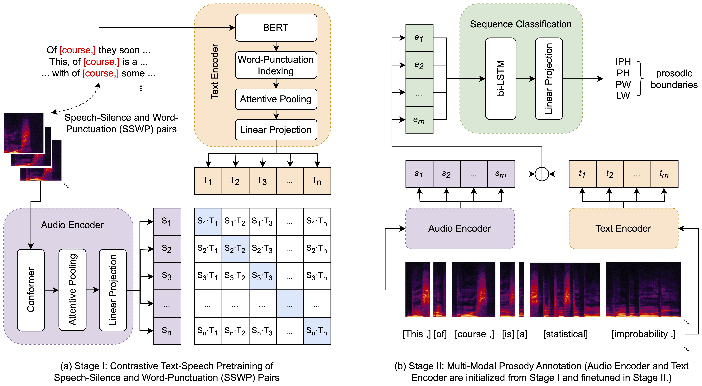

# Multi-modal Automatic Prosody Annotation with Contrastive Pretraining of SSWP

<!-- ### [Arxiv](https://arxiv.org/abs/2309.05423) &nbsp;&nbsp;&nbsp;&nbsp; [Demo](https://jzmzhong.github.io/Automatic-Prosody-Annotator-With-SSWP-CLAP/) -->
<!-- <table style="border:1px solidb ack;margin-left:auto;margin-right:auto;border-spacing:20px;">
    <tr>
    <td><h3><a href="https://arxiv.org/abs/2309.05423">Arxiv</a></h3></td>
    <td><h3><a href="https://jzmzhong.github.io/Automatic-Prosody-Annotator-With-SSWP-CLAP">Demo</a></h3></td>
    <td><h3><a href="https://github.com/jzmzhong/Automatic-Prosody-Annotator-with-SSWP-CLAP">Code (Here)</a></h3></td>
    </tr>
</table> -->

<!-- ###  [Demo](https://jzmzhong.github.io/Automatic-Prosody-Annotator-With-SSWP-CLAP) [Code(Here)](https://github.com/jzmzhong/Automatic-Prosody-Annotator-with-SSWP-CLAP) -->

This is the official implementation of the following paper ([Arxiv](https://arxiv.org/abs/2309.05423)):

> **Multi-Modal Automatic Prosody Annotation with Contrastive Pretaining of SSWP** \
> Jinzuomu Zhong, Yang Li, Hui Huang, Jie Liu, Zhiba Su, Jing Guo, Benlai Tang, Fengjie Zhu

> **Abstract**: *In the realm of expressive Text-to-Speech (TTS), explicit prosodic boundaries significantly advance the naturalness and controllability of synthesized speech. While human prosody annotation contributes a lot to the performance, it is a labor-intensive and time-consuming process, often resulting in inconsistent outcomes. Despite the availability of extensive supervised data, the current benchmark model still faces performance setbacks. To address this issue, a two-stage automatic annotation pipeline is novelly proposed in this paper. Specifically, in the first stage, we propose contrastive text-speech pretraining of Speech-Silence and Word-Punctuation (SSWP) pairs. The pretraining procedure hammers at enhancing the prosodic space extracted from joint text-speech space. In the second stage, we build a multi-modal prosody annotator, which consists of pretrained encoders, a straightforward yet effective text-speech feature fusion scheme, and a sequence classifier. Extensive experiments conclusively demonstrate that our proposed method excels at automatically generating prosody annotation and achieves stateof-the-art (SOTA) performance. Furthermore, our novel model has exhibited remarkable resilience when tested with varying amounts of data.*


# Model Architecture

<!-- Method -->
<h3>The Architecture of Our Proposed Work</h3>
<figure>
<p style="text-align:center"></p>
</figure>

# Results & Demos

<!-- Ojective Evaluation -->
<h3>Objective Evaluation</h3>
The results of our proposed work, compared with previous benchmarks, are shown below.
<figure>
<p style="text-align:center"></p>
</figure>


Audio Samples Demo are avaialble at: [Demo](https://jzmzhong.github.io/Automatic-Prosody-Annotator-With-SSWP-CLAP/)


# Quickstart

## Environment Installation

```bash
conda create -n clap python=3.10
conda activate clap
# you can also install pytorch by following the official instruction (https://pytorch.org/get-started/locally/)
pip install torch==1.11.0+cu113 torchvision==0.12.0+cu113 torchaudio==0.11.0+cu113 -f https://download.pytorch.org/whl/torch_stable.html
pip install -r requirements.txt
```

## Multi-modal Prosody Annotation

### Data Process

The model requires the input data to be aligned using Kaldi. After that, it needs to be converted to the format of the sample data.

Text Features are stroed in *.json; Audio features are stored in *.mel.npy.

```shell
./sample_data/prosody_annotation
├── wordboundarylevel_ling
│   └── internal-spk1-test
└── wordboundarylevel_mel
    └── internal-spk1-test
```

To convert audio to mel, you can refer to the following command:

```base
cd data_process
python 01_wav2mel.py
```

### Sample Inference Script

```base
bash ./example/01_inference_prosody_annotation.sh
```
### Released Multi-modal Prosody Annotator 

```
./released_model/pretrained_SSWP_CLAP.pt
```


# References

We are grateful for the following open-source contributions. Most of our codes are based on [LAION-AI's CLAP](https://github.com/LAION-AI/CLAP), with the Conformer part from [ESPNET](https://github.com/espnet/espnet).

- [LAION-AI's CLAP](https://github.com/LAION-AI/CLAP)
- [ESPNET](https://github.com/espnet/espnet)
- [CLAPSpeech](https://clapspeech.github.io/)
- [Automatic Prosody Annotation](https://github.com/Daisyqk/Automatic-Prosody-Annotation)
